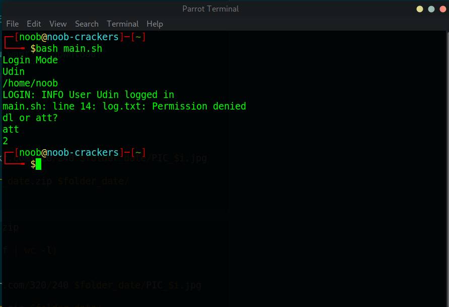
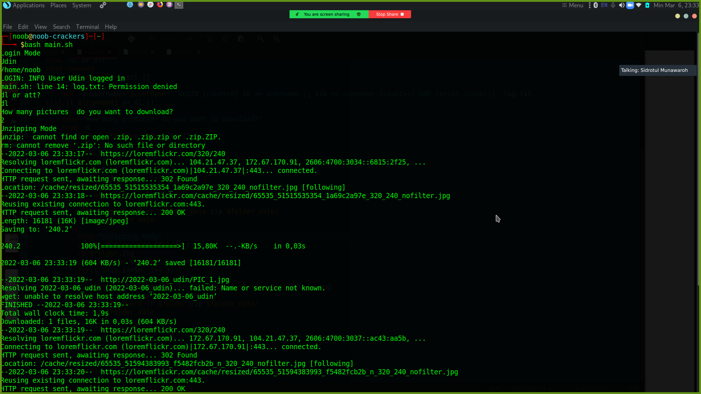
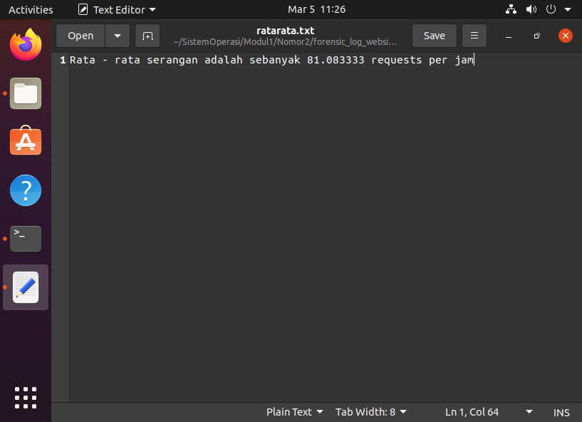
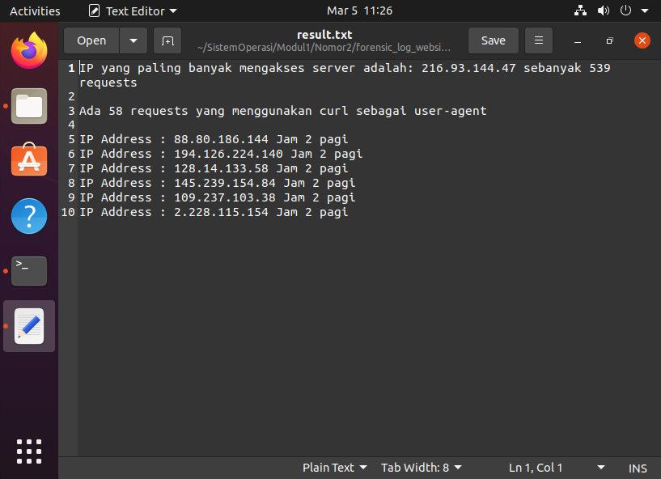
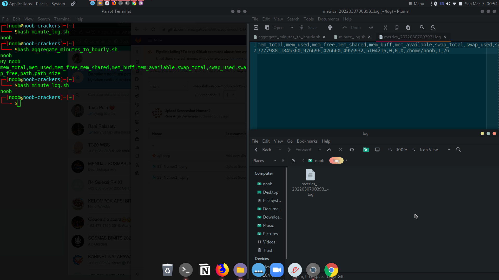

# **soal-shift-sisop-modul-1-B05-2022** #

Kelompok B05 Sistem Operasi B Tahun 2022

Nama Lengkap | NRP
------------- | -------------
Fahmi Muhazir        | 5025201043
Sidrotul Munawaroh   | 5025201047
Rere Arga Dewanata   | 5025201078 

## Jawaban Soal 1

### Kendala Soal 1
Pada nomor 1C, Ketika user mencoba login namun passwordnya salah, maka message pada log adalah LOGIN:ERROR Failed login attempt on user USERNAME.
Pada nomor 1D, gambar tidak memiliki nama yang sesuai dan tidak dapat dimasukan kedalam folder yang sesuai.

### 1A 
**Deskripsi Soal**
Membuat sistem register pada script register.sh  yang setiap user yang didaftarkan dan disimpan di dalam file ./users/user.txt

**Kode Program**
```
path=pwd
echo "Register Mode"

read  username

read -r -s password
date=$(date '+%Y-%m-%d %H:%M:%S')

if grep -qi ${username} user.txt;

```

**Penyelesaian**
Membuat file register.sh yang bisa mengecek isi file dari user agar tidak ada username yang sama.

### 1B
**Deskripsi Soal**
Membuat input password pada saat login dan register harus tertutup dan password yang terdaftar harus memiliki beberapa kriteria yang ditentukan

**Kode Program**
```
if [[ ${username} != ${password} ]]; then
        if [[ ${password} =~ [A-Za-z0-9]{8,} ]]; then
            if [[ ${password} =~ [A-Z] && ${password} =~ [a-z] && ${password} =~ [0-9] ]]; then

```

**Penyelesaian**
Fungsinya untuk mengecek username yang sama, mengecek password minimal 8 character berupa alphanmeric, dan mengecek password minimal memiliki 1 lowercase dan uppercase.

### 1C
**Deskripsi Soal**
Setiap percobaan login dan register akan tercatat log.txt dengan format MM/DD/YY hh:mm:ss MESSAGE. Maka log message akan berbeda tergantung aksi yang dilakukan oleh user

**Penyelesaian**
Setiap login yang di lakukan user akan tercatat di log.txt sesuai dengan tanggal percobaannya
```
date=$(date '+%Y-%m-%d %H:%M:%S')
```
Ketika percobaan register tersedia maka log adalah 
```
echo "${date} REGISTER: Error User already exist" >> log.txt
```
Ketika percobaan register berhasil maka, log adalah
```
echo "${date} REGISTER: INFO User ${username} registered successfully" >> log.txt
```
Ketika percobaan register password tidak minimal 1 huruf besar dan 1 huruf kecil, maka log adalah 
```
echo "${date} REGISTER: Error Password must constaint from uppercase, lowercase, and numeric" >> log.txt
```
Ketika percobaan register password tidak 8 character maka log adalah
```
echo "${date} REGISTER: Error Password must constaint minimal 8 characters" >> log.txt
```
Ketika percobaan register dengan username dan password sama, maka log adalah 
 ```
echo "${date} REGISTER: Error Password must not same the username" >> log.txt
```
### 1D
**Deskripsi Soal**
Setelah login, user dapat mengetikkan 2 command dengan dokumentasi dl N (N = Jumlah gambar yang akan di download) dan att untuk menghitung jumlah percobaan login baik yang berhasil atau tidak dari user yang sedang login saat itu.

**Kode Program**
```
 then 
        echo "How many pictures  do you want to download?"
        read  n
        if [[ ! -f "$folder_date.zip" ]]
        then
            echo "Zipping"
            mkdir $folder_date
            count=0
            for(( i=1; i<=$n; i++ ))
            do
                wget https://loremflickr.com/320/240 $folder_date/PIC_$i.jpg
            done 
            zip -P $password -r $folder_date.zip $folder_date/
	        rm -rf $folder_date
        else
            echo "Unzipping Mode"
            unzip -P $password $folder.zip
            rm $folder.zip
            count=$(find $folder -type f | wc -l)
            for(( i=1; i<=$n; i++ ))
            do
               wget https://loremflickr.com/320/240 $folder_date/PIC_$i.jpg
            done 
            zip -P $password -r $folder.zip $folder_date/
	        rm -rf $folder_date
        fi

```
**Penjelasan**
Pada saat memasukan comand dl maka akan mendownload gambar dari https://loremflickr.com/320/240 dengan
jumlah sesuai dengan yang diinputkan oleh user. Kemudian di masukan kedalam folder YYYY-MM-DD_USERNAME dan format penamaan file nya adalah PIC_XX. Namun terdapat kendala untuk memasukan file kedalam folder dan merubah nama file nya menjadi sesuai yang di inginkan, kemudian untuk comand att, akan menghitung berapa log user yang mencoba login baik berhasil ataupun tidak.

### Screenshot Soal 1



## Jawaban Soal 2  

### Kendala Soal 2  
Pada nomor 2C, hasil IP pada awalnya menunjukan hasil yang tidak sesuai, tetapi dapat diatasi dengan mengubah kode dan didapatkan hasil yang telah sesuai  

### Screenshot Soal 2  



### 2A
**Deskripsi Soal**  
Membuat folder baru bernama "forensic_log_website_daffainfo_log"

**Kode Program**  
```
#!/bin/bash
DefaultFolder=/home/argadewanata/SistemOperasi/Modul1/Nomor2
mkdir -p $DefaultFolder/forensic_log_website_daffainfo_log

```

**Penjelasan**  
Menggunakan mkdir -p agar membuat folder sekaligus membuat parent directorynya apabila belum tersedia. Folder ini terdapat pada path folder/home/argadewanata/SistemOperasi/Modul1/Nomor2/forensic_log_website_daffainfo_log

### 2B  
**Deskripsi Soal**  
Membuat file yang bernama "ratarata.txt" yang berisi rata rata request per jam  

**Kode Program**
```
cat $DefaultFolder/log_website_daffainfo.log | awk -F: '{if (NR == 2)
	  {
	    request = $3; 
	  }
	 }
	END{
	  total_request = NR - 1;
	  printf "Rata - rata serangan adalah sebanyak %f requests per jam\n", total_request/12
	}' >  $DefaultFolder/forensic_log_website_daffainfo_log/ratarata.txt

```  
 
**Penjelasan**  
1. Menggunakan awk agar mampu mengambil record tertentu dan melakukan operasi padanya  
2. -F: berarti tanda ":" menjadi pemisah antar argumen    
3. Argumen ke-3 ditandai dengan $3 yang kemudian di assign ke variabel request  
4. Variabel total_request = NR - 1 karena baris pertama pada record bukanlah sebuah argumen  
5. Lalu, total_request /12 karena pada record terjadi selama 12 jam
6. Kemudian, hasil tersebut dimasukan ke dalam ratarata.txt

### 2C  
**Deskripsi Soal**  
Membuat file yang bernama "result.xt" yang berisi alamat IP yang melakukan request terbanyak dan total request yang dikirimkan oleh IP tersebut

**Kode Program**
```  
cat $DefaultFolder/log_website_daffainfo.log | awk -F'"' '{ arr_of_IP[$2]++}
	END {
		maxRequest = 0
		IP_dest
 		for(i in arr_of_IP){
			if (maxRequest < arr_of_IP[i]){
			    IP_dest = i
			    maxRequest = arr_of_IP[IP_dest]
			}
		}
		print "IP yang paling banyak mengakses server adalah: " IP_dest " sebanyak " maxRequest " requests\n"
	}' >  $DefaultFolder/forensic_log_website_daffainfo_log/result.txt

```  

**Penjelasan**
1. Menggunakan awk agar mampu mengambil record tertentu dan melakukan operasi padanya  
2. -F'"' berarti tanda " menjadi pemisah antar argumen
3. Argumen ke-2 ditandai dengan $2 yang kemudian jumlahnya dimasukkan ke dalam arr_of_IP  
4. Menggunakan array untuk menghitung banyaknya request tiap IP kemudian dibandingkan dan hasilnya dimasukan ke dalam result.txt  

### 2D  
**Deskripsi Soal**  
Menambahkan jumlah request yang menggunakan user-agent curl pada file "result.txt"

**Kode Program**
``` 
cat $DefaultFolder/log_website_daffainfo.log | awk '/curl/ {++count}
    END {
          printf "Ada %d requests yang menggunakan curl sebagai user-agent\n\n", count
        }' >>  $DefaultFolder/forensic_log_website_daffainfo_log/result.txt

```  
**Penjelasan**  
Mencari jumlah kata 'curl' dan disimpan ke dalam variabel count dan hasilnya ditambahkan pada file 'result.txt' yang sudah ada

### 2E 
**Deskripsi Soal**  
Menambahkan request yang mengakses website pada 02.00 pada file 'result.txt'  

**Kode Program**
``` 
cat $DefaultFolder/log_website_daffainfo.log | awk -F: '/2022:02/ {gsub(/"/, "", $1)
   		    IP_arr[$1]++}

	END {
		for (IP in IP_arr){
			printf "IP Address : %s Jam 2 pagi\n",IP
		}

	}' >>  $DefaultFolder/forensic_log_website_daffainfo_log/result.txt

``` 

**Penjelasan**
1. Menggunakan awk agar mampu mengambil record tertentu dan melakukan operasi padanya   
2. Mencari pattern /2022:02/ atau pukul 02.00 dan menambahkan ke dalam IP_arr
3. Menambahkan output kepada result.txt

## Jawaban Soal Nomor 3
### 3A
**Deskripsi soal**
Masukkan semua metrics ke dalam suatu file log bernama metrics_{YmdHms}.log.
{YmdHms} adalah waktu disaat file script bash kalian dijalankan. Misal dijalankan
pada 2022-01-31 15:00:00, maka file log yang akan tergenerate adalah
metrics_20220131150000.log.

**Source Code**
```
#!/bin/bash

#Making Directory for log of file
mkdir -p log

#Identify user
USER= id -u -n

#Making variabel as format name of file"
FILE="$(date +"%Y%m%d%H%M%S")"

#Making directory of file
DIR_OUT="/home/noob/Documents/sisop/Mod1/soal3/log/metrics_$FILE.log" 

#Write a format to file, with path of file
echo "mem_total,mem_used,mem_free,mem_shared,mem_buff,mem_available,swap_total,swap_used,swap_free,path,path_size" > $DIR_OUT


MEM="$(free | awk '/Memory:/ {printf "%s,%s,%s,%s,%s,%s", $2,$3,$4,$5,$6,$7}')"
SWAP="$(free | awk '/Swap:/ {printf "%s,%s,%s", $2,$3,$4}')"
STORAGE="$(du -sh /home/noob/Documents/sisop/Mod1/soal3 | awk '{printf "%s,%s",$2,$1}')"


echo "$MEM,$SWAP,$STORAGE" >> $DIR_OUT | chmod 700 /home/noob/Documents/sisop/Mod1/soal3/log/metrics_$FILE.log
```

**Penjelasan**
1. Membuat folder untuk log file
2. Membuat variable untuk nama
3. Mmebuat variable path untuk log file
4. Mendapatkan data memori dengan (free -m) yang outputnya akan menjadi masukian dari perintah awk dengan menetapkan pola /Mem:/. dari $2 hingga $7
5. Kemudian data swap, digunakan pola /Swap:/ pada awk. Setiap kata keluarannya juga diprint berdasarkan input argumen $2 hingga $4.
6. Menyimpan data yang sudah dicari ke path DIR_OUT
7. Merubahn aksebilitas file dengan chmod 700 -rwx——

### Kendala mengerjakan file aggregate_minutes_to_hourly.sh

Tahap pengerjaan hanya baru sampai pada pengambilan variabel data. Kendalaya adalah sulit menentukan cara untuk mengambil value dari data yang ada, agar dapat dilakukan pemrosesan sehingga menghasilkan output yang dinginkan
```
#!/bin/bash

#gabut 
USER= id -u -n
echo Hy $USER


#buat variabel biar ezzz
Date= $(date + '%Y%m%d%H')
Pattern= "mem_total,mem_used,mem_free,mem_shared,mem_buff,mem_available,swap_total,swap_used,swap_free,path,path_size"
DIR_OUT="/home/noob/Documents/sisop/Mod1/soal3/log/metrics_$FILE.log"

#Checkin var of file when it have "mem", used grep
check_var() {
	for file in $($DIR_OUT/log/metrics_2022* | grep $Date)
	do cat $file | grep -v mem 
	done
}

#Gain the value from every output file


#Input without replace oldes value
echo $Pattern  >> $DIR_OUT
```



  
